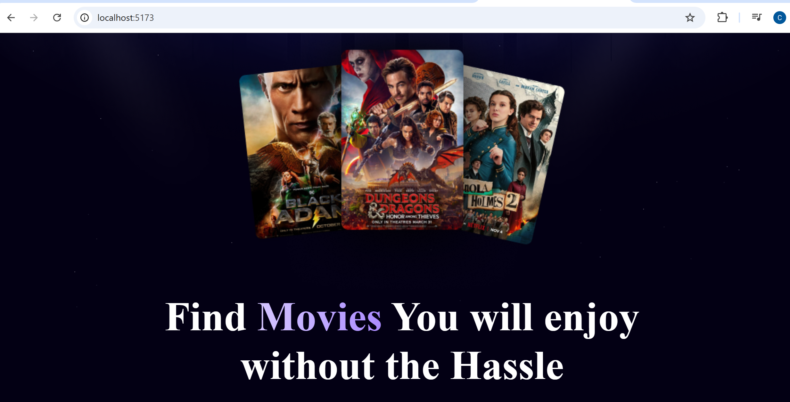

# Movie Search App

A React application that allows users to search for movies using the OMDB API. The app displays movie details and handles loading and error states gracefully.

## Features

- Search for movies by title.
- View movie details including title, year, and poster.
- Loading spinner while fetching data.
- Error handling for invalid searches or network issues.
- Responsive and clean UI design.

## Technologies Used

- React.js (Functional Components & Hooks)
- OMDB API
- CSS for styling

## Installation

1. **Clone the repository:**

```bash
git clone https://github.com/Chudamani-K/movie-search-app.git


## Project Structure

my-first-react/
├── public/           # Public assets like images
├── src/
│   ├── components/   # React components (Search, Spinner, MovieCard)
│   ├── App.jsx       # Main App component
│   └── index.js      # Entry point
├── package.json
└── README.md


## Future Enhancements

- Add trending movies feature with backend
- Detailed movie pages with more info
- Deploy the app online for live demo


## Screenshots


